## Screenshots

Screenshots of key flows and features of SimpleOffer

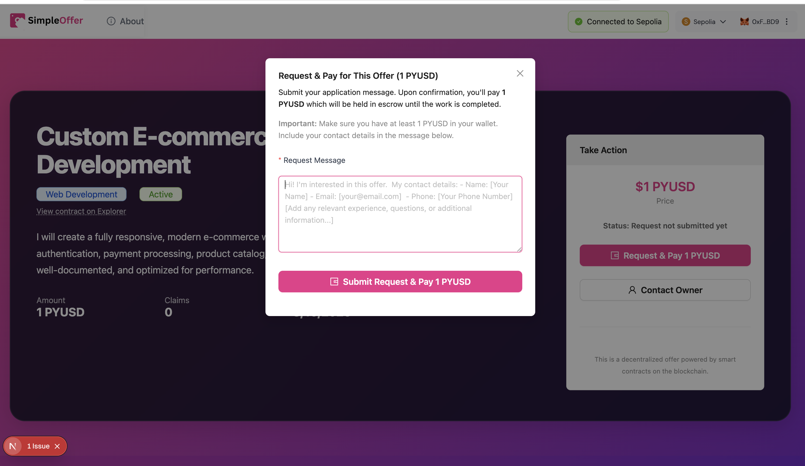
*Adding Custom Message to Request*

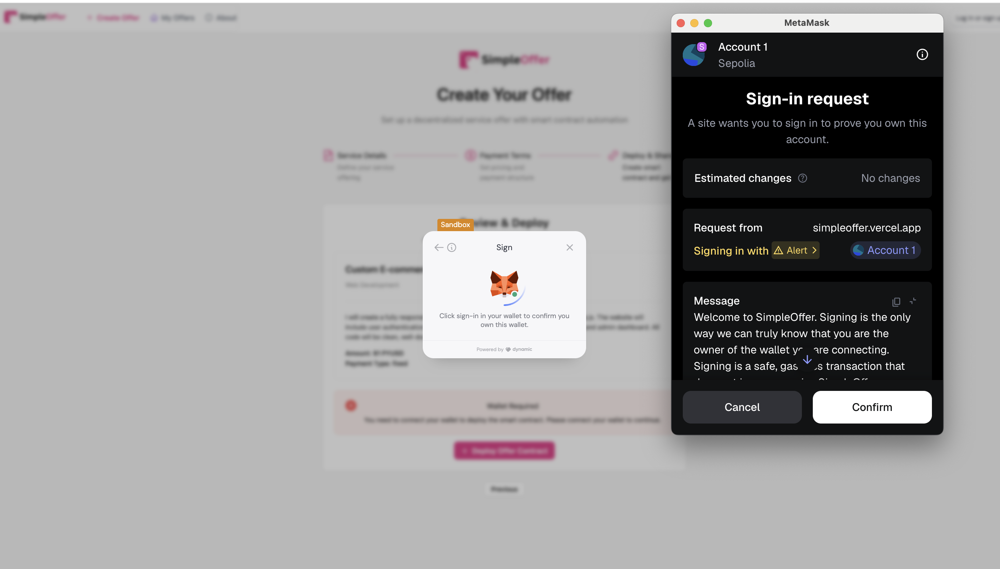
*Authenticating with Dynamic*

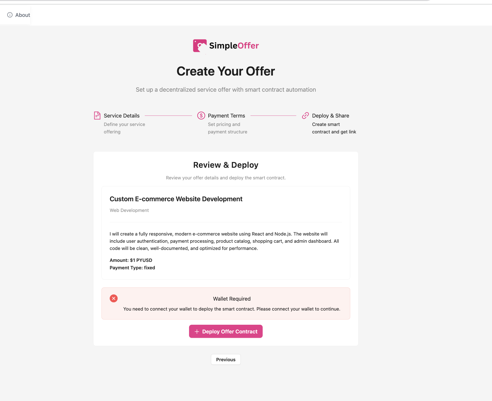
*Connect Wallet Error State*

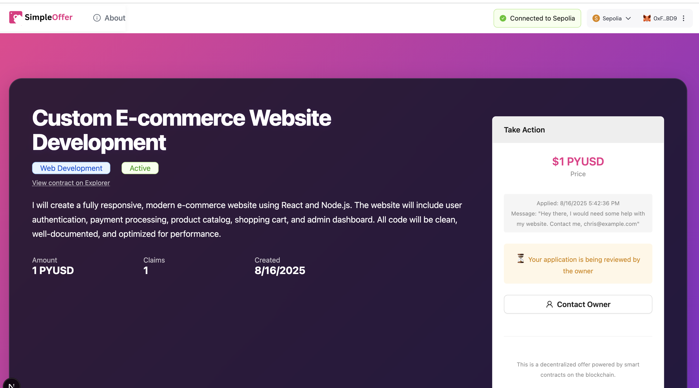
*Customer Screen with Sent Request*

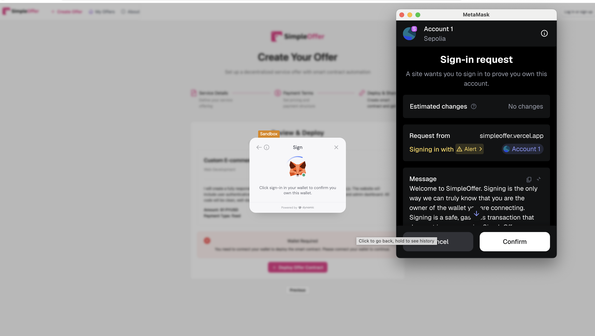
*Dynamic XYZ Seamless Wallet Change*

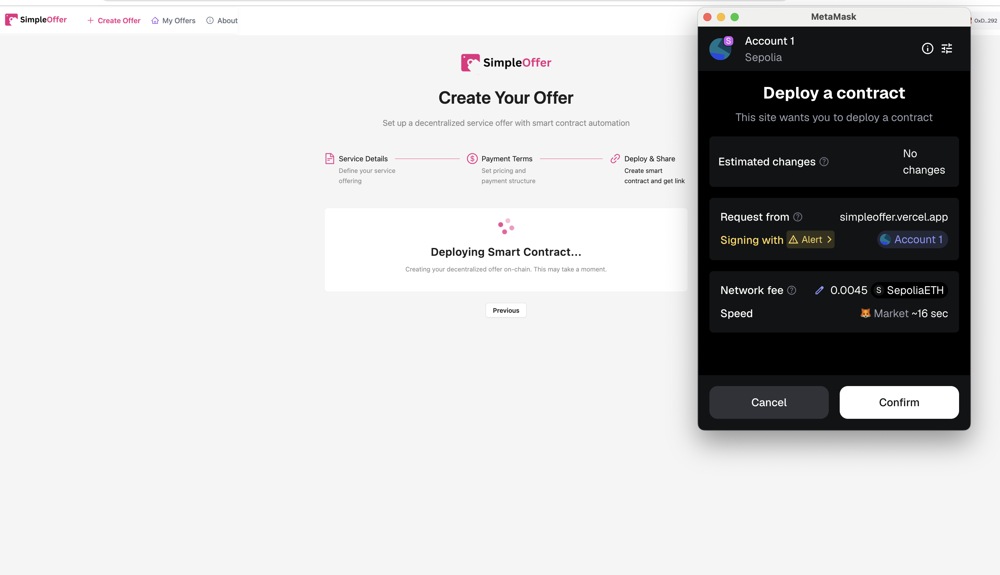
*Each Offer Gets Unique Contract*

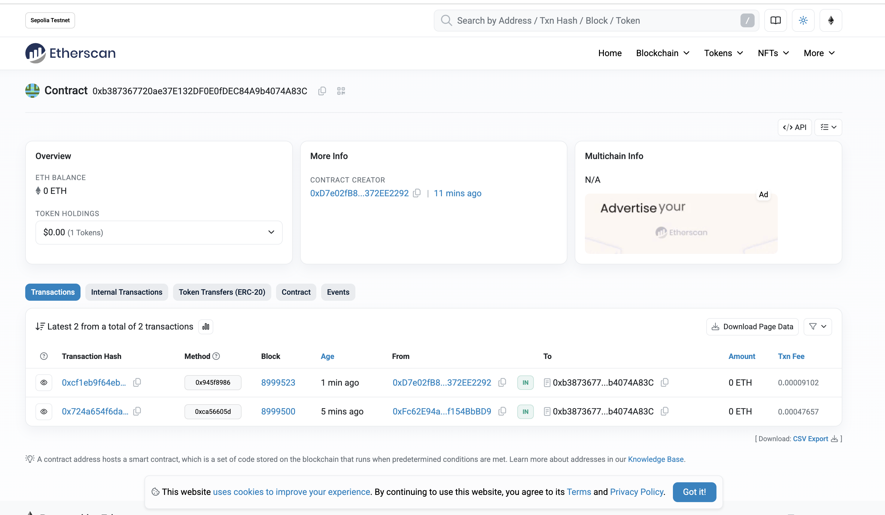
*Example Contract and Transactions*

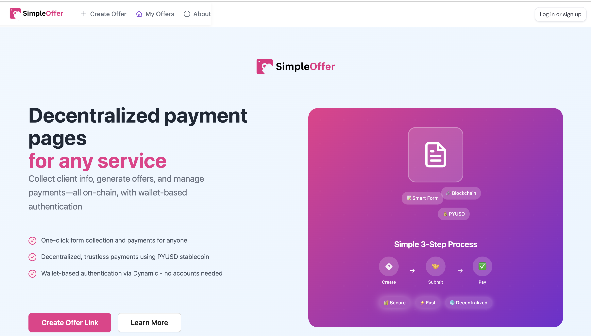
*Home Page*

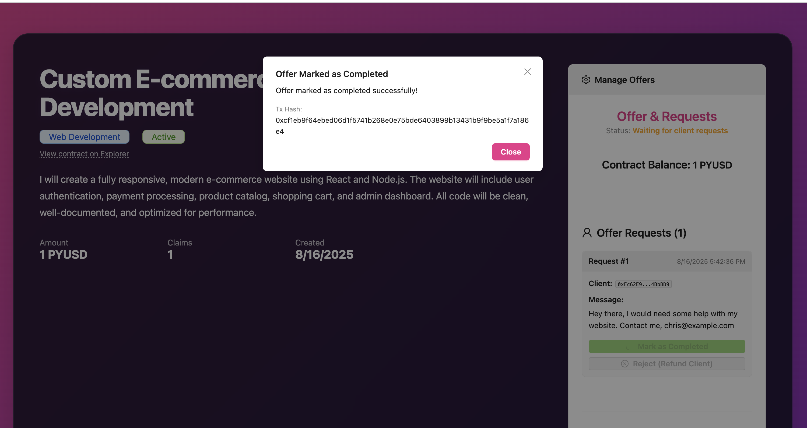
*Offer Marked Completed*

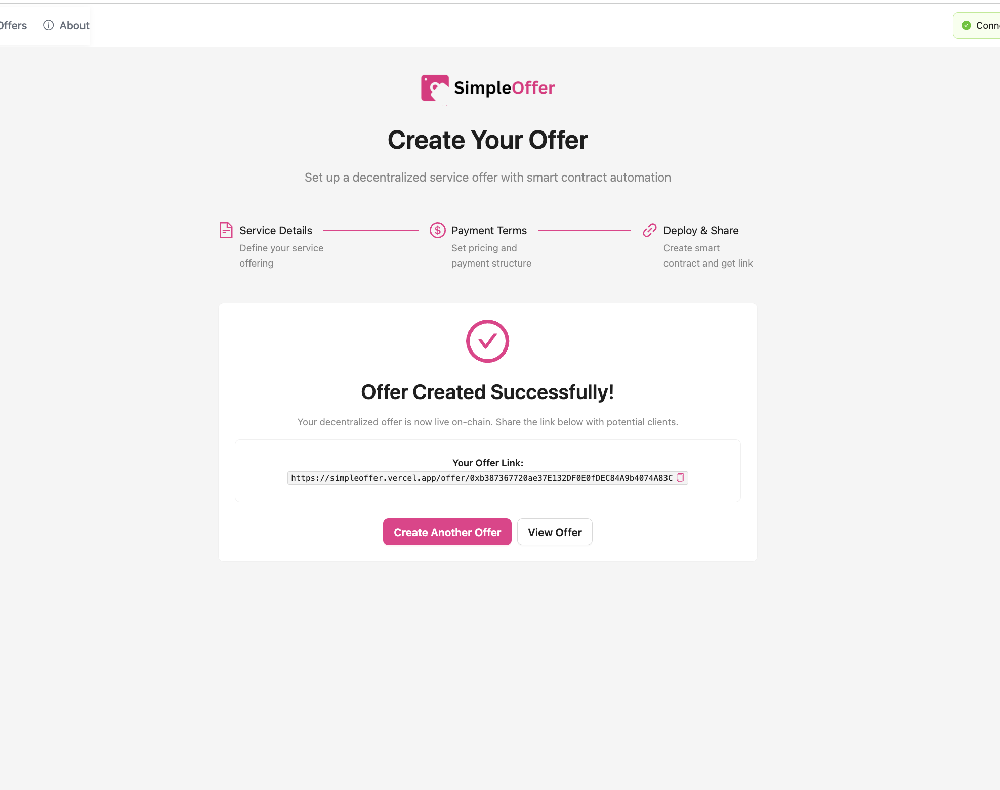
*Order Page Created Successfully*

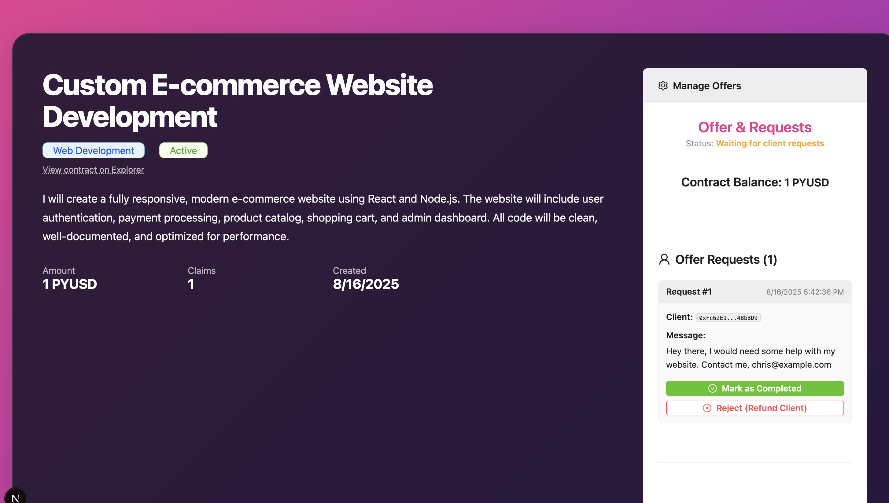
*Owner Page with Offer*

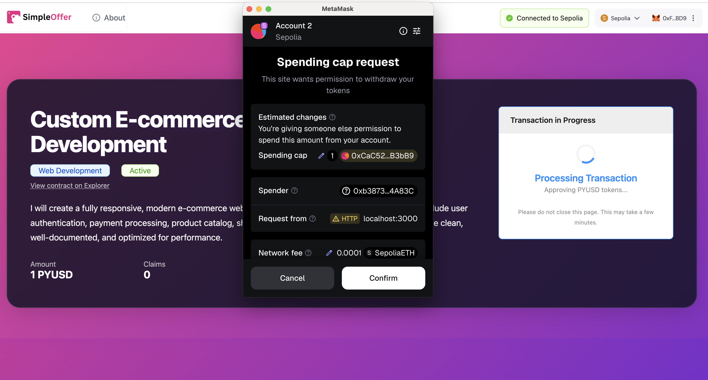
*Sending PYUSD Payment as a Visitor*

*Service Use Cases*

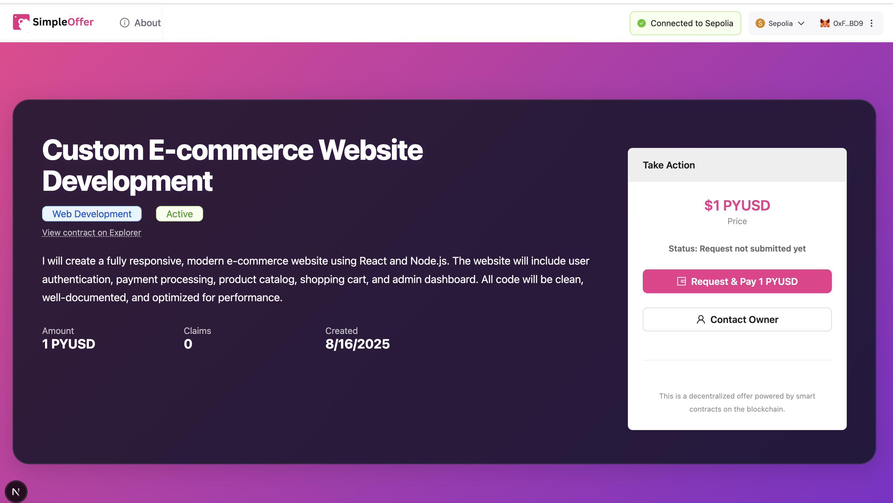
*Screenshot 2025-08-16 at 5.41.40 PM*

    

SimpleOffer
---

One click form collection and payments backed by smart contracts for any service backed by PYUSD.

Demo: https://simpleoffer.vercel.app

Example offer page: https://simpleoffer.vercel.app/offer/0xb387367720ae37E132DF0E0fDEC84A9b4074A83C (Sepolia)

Demo video: 

## Problem

Service providers, freelancers, and small businesses often struggle to:  

- Collect structured client information (quotes, offers, requests) quickly and reliably  
- Manage payments securely without relying on centralized escrow or third-party platforms  
- Verify approvals, deposits, or milestone completion in a trustless, transparent way  
- Handle authentication and identity verification without complex account setups  

This friction leads to slower response times, missed opportunities, and disputes between clients and service providers.  

---

## Where current solutions fall short
Existing solutions partially address these problems, but often have limitations or drawbacks:

| Existing Solution | Shortcomings |
|-----------------|--------------|
| **Google Forms + PayPal/Stripe** | Form submission and payment are separate; no trustless link between submission and payment; no automated verification |
| **Typeform + Stripe** | No on-chain verification; payments are off-chain; limited automation for approvals or milestone tracking |
| **Freelance marketplaces (Fiverr, Upwork)** | High fees; platform controls the workflow; limited transparency; providers can’t fully customize contract/payment logic |
| **Smart contract marketplaces (OpenLaw, Clause.io)** | Require technical knowledge; onboarding and wallet setup is a barrier; no simple one-click form collection for clients |

---

## Solution

**SimpleOffer** provides a **one-click, decentralized form + payment system** for service providers and clients. Here’s the typical user journey:

### How it works (step-by-step):
1. **Connect wallet** via Dynamic → authenticate client/pro
2. **Client submits service request form** (optionally AI-assisted validation)
3. **Smart contract is deployed** via Hardhat → PYUSD payment deposited
4. **Service provider reviews request** (optionally AI-assisted offer generation)
5. **Client approves** → contract releases payment automatically
6. **Optional:** ENS, NFT receipt, and document verification for enhanced trust

---

### Technology Breakdown

#### Dynamic
Dynamic provides wallet-based authentication for both clients and service providers, enabling seamless login and contract interaction through viem integration. Email enforcement and connection on offer pages ensure that users are verified and actionable. The frontend is integrated for one-click wallet connect, offer creation, and payment flows, making the platform accessible to everyone—not just Web3 experts. Looking ahead, the roadmap includes support for more chains, on-chain deployed status, and discount codes based on Dynamic groups.

#### PYUSD
PYUSD enables stable, non-volatile payments for businesses and freelancers. All deposits, milestone completions, and offers are settled in PYUSD, ensuring predictable value transfer without banking fees or volatility risk.

#### Hardhat
A contract is deployed for every offer page. We use hardhat to ensure there won't be any errors and enable the test ABI to be built and transferred as part of the deploy process to the SingleOffer app.
The SingleOffer contract has a local script in `update-metadata.js` which automatically updates this based on the hardhat build output. 

SingleOffer also has both an ignition module for command line contract deployments and solidity unit tests as part of the build.

---

**Key Differentiators:**

- Fully **decentralized** and **trustless** payments
- **AI-assisted smart contracts** (no Solidity knowledge required)
- **One-click form collection** reduces friction for clients
- Optional **readable ENS profiles** for trust and reputation

---

## Usage Quick Reference

| Command | Description |
|---------|-------------|
| `yarn build` | Compile all smart contracts and generate artifacts |
| `yarn apply` | Copy contract ABIs and types to the frontend app for integration |
| `yarn test` | Run all contract and integration tests (JS/TS and Solidity) |
| `yarn deploy:simpleoffer:local` | Deploy SimpleOffer contracts to a local Hardhat node |
| `npx hardhat ignition deploy --network sepolia ignition/modules/SimpleOffer.ts` | Deploy SimpleOffer contracts to Sepolia testnet using Ignition |

## Future Business Model

| Revenue Stream | Description |
|---------------|-------------|
| **Transaction Fees** | 0.5-1% fee on contract creation (much lower than Upwork/Fiverr) |
| **Premium Features** | $10-50/month for analytics, branding, support, bulk tools |
| **Payment Processing** | 0.25% fee on invoices or high-value transactions |
| **Value-Added Services** | Legal templates, dispute resolution, insurance, integrations |
| **Data Insights & Analytics** | Market insights, benchmarking, matching algorithms |

**Why this model?**
- Lower fees and more transparency than traditional platforms
- Recurring revenue from SaaS features and B2B analytics
- Value-added services create new business opportunities

**Revenue Projections:**
With 1000 active contracts/month at $2000 average value, transaction fees alone could generate $10-20K monthly, with additional recurring revenue from subscriptions and enterprise tiers.

---

## Potential Future Work

- **Recurring subscriptions/retainers:** Automate recurring service payments using PYUSD smart contracts
- **Cross-chain support:** Use LayerZero or Hyperlane to allow payments/contracts across multiple chains
- **Reputation & review system:** Track completed offers and release ratings as verifiable on-chain badges
- **Integration with fiat on-ramps:** Via Dynamic’s Coinbase integration for clients who want to pay with fiat
- **Configurable themes:** Enable users to customize checkout backgrounds and color palettes

---

